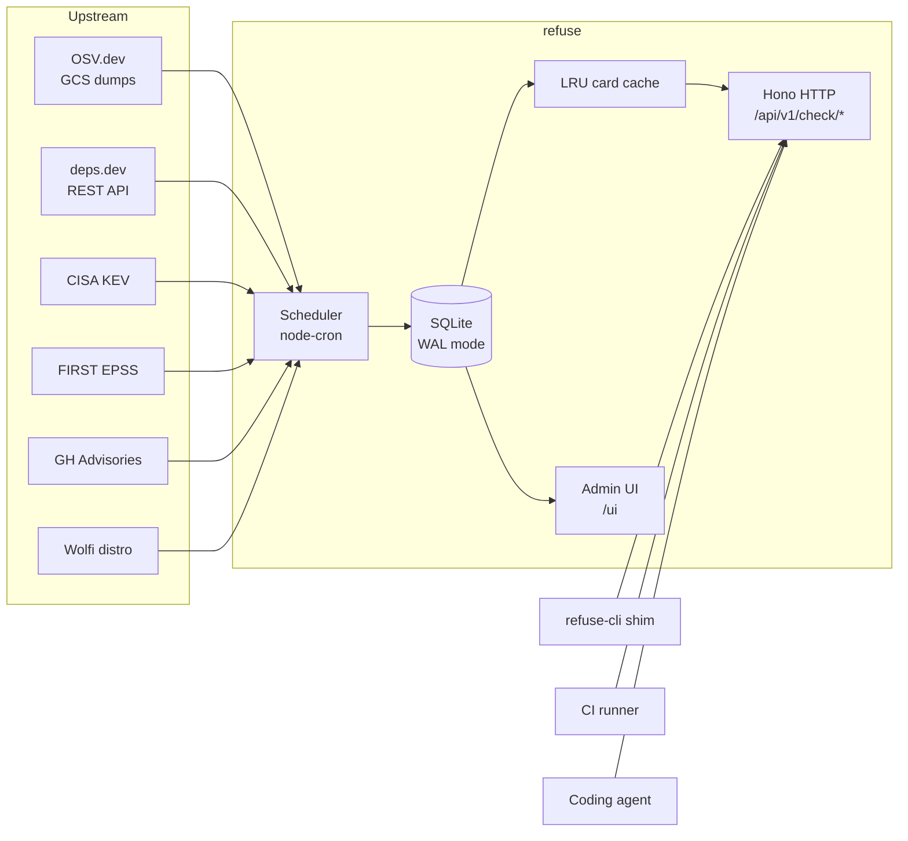

# Architecture

This document explains how refuse is put together — enough to land a meaningful PR without having to read the whole codebase first.

## The 30-second version



A single Node process:

1. **Ingests** vulnerability + metadata feeds on a cron schedule.
2. **Stores** the normalized result in local SQLite (a "card" per `(ecosystem, name, version)` keyed lookup).
3. **Answers** REST queries from `refuse-cli`, CI runners, or any client that wants to vet a package install before it happens.

No queues, no Redis, no Postgres, no external state. The only thing on disk is `data/refuse.db`.

## Layout

```
apps/server/
  src/
    index.ts            # boot: config → db → router → scheduler → listen
    config.ts           # Zod-validated env vars
    http/
      router.ts         # all routes
      auth.ts           # bearer-token middleware
      cors.ts
    ingest/
      osv.ts            # OSV.dev GCS pulls
      deps-dev.ts       # deps.dev REST
      kev.ts            # CISA KEV
      epss.ts           # FIRST EPSS
      ghsa.ts           # GitHub Security Advisories
      wolfi.ts          # Wolfi distro packages
    parsers/
      lockfile/         # one file per format
      dockerfile/       # base-image + RUN apt-get parsing
      workflow/         # GitHub Actions YAML
    db/
      schema.sql        # current schema
      migrations/       # ordered SQL files
      queries.ts        # named queries, all hand-rolled
      d1-adapter.ts     # makes better-sqlite3 look like Cloudflare D1
    cards.ts            # LRU on top of DB lookups
    ui/static/          # vanilla HTML + JS admin dashboard
packages/
  shared/               # Zod schemas, ecosystem enum, DB row types
  versions/             # per-ecosystem semver-equivalent comparators
docker/                 # multi-stage Dockerfile + compose
docs/                   # user-facing
scripts/audit.sh        # CI gate: rejects vendor-locked deps
```

## Data model

Each row in the `cards` table is a denormalized, query-ready answer for one `(ecosystem, name, version)` lookup. We build cards from raw upstream data in `cards.ts` so that the hot read path is a single indexed SELECT.

Other tables:

- `osv_advisories` — raw OSV records, keyed by ID.
- `package_versions` — `(ecosystem, name)` → list of known versions from deps.dev.
- `kev` — CISA's "known exploited" list.
- `epss` — FIRST exploit-prediction scores.
- `wolfi_packages` — for Dockerfile scanning of Wolfi-based images.
- `ingestion_state` — last-run timestamp + last-ok for each source.
- `api_keys` — optional bearer tokens (with CRUD via admin API).

Schema lives in `apps/server/src/db/schema.sql`. Migrations are append-only ordered files in `apps/server/src/db/migrations/`.

## The D1 adapter

The query layer is written against a D1-shape API (`prepare().bind().all()`). A thin adapter in `db/d1-adapter.ts` makes `better-sqlite3` look like that binding, so the same code can run on a server or on a Cloudflare Workers/D1 deployment without forking.

When you add a query, target the D1-shape API.

## Ingest pipeline

`ingest/*.ts` adapters are scheduled by `node-cron`. The three jobs:

- Every ~5 min: OSV delta pull (one ecosystem per tick, round-robin).
- Every ~15 min: deps.dev refresh (paginated).
- Daily at 05:00 UTC: enrichment — KEV, EPSS, GHSA, Wolfi.

Each adapter is responsible for:

1. Pulling from upstream.
2. Validating with the Zod schema in `packages/shared/src/schema.ts`.
3. Upserting into the relevant table.
4. Marking its row in `ingestion_state`.

Adapters are pure-ish: they take a `Db` + a `Fetch` and return a count. This makes them testable without mocking HTTP.

## Hot path: a `/api/v1/check/package` request

```
client → Hono router → auth middleware → handler
                                       ↓
                            normalize ecosystem string
                                       ↓
                            normalize version (PEP 440 / semver / etc.)
                                       ↓
                            LRU cache hit?  → yes → respond
                                       ↓ no
                            SQL: SELECT card WHERE eco=? AND name=? AND version range matches
                                       ↓
                            populate LRU, respond
```

Typical p99 on a warmed cache is under 5 ms locally.

## Parsers

Lockfile parsers, the Dockerfile parser, and the GitHub Actions parser are **pure functions**. They take a string and return a `ParseResult` (list of `(ecosystem, name, version)` triples plus metadata). No I/O, no logging.

This is intentional. It means:

- They're trivially testable (paste a real lockfile into `*.test.ts`).
- They can run in CI, in a Docker build stage, in a browser, in a Worker.
- New ecosystems can be added by anyone without touching the server.

## What lives where

| Concern | Lives in |
| --- | --- |
| Adding a new vulnerability source | `apps/server/src/ingest/<source>.ts` |
| Adding a new package manager | `packages/versions/src/<eco>.ts` + `packages/shared/src/ecosystems.ts` + `apps/server/src/parsers/lockfile/<eco>.ts` |
| Tweaking the HTTP API | `apps/server/src/http/router.ts` |
| Changing the DB schema | New file in `apps/server/src/db/migrations/` (never edit old ones) |
| Auth / API keys | `apps/server/src/http/auth.ts` + `apps/server/src/db/queries.ts` |
| Admin dashboard | `apps/server/src/ui/static/` |

## Non-goals

A few things that refuse explicitly will **not** become:

- A general-purpose SCA tool. We're focused on the gate-at-install moment, not the post-hoc audit. (See OSV-scanner, Trivy, Dependency-Track for that.)
- A package registry. We don't host packages.
- A typosquatting / malicious-package detector. That's a separate problem domain. (See guarddog, npq.)
- A policy engine. The decision is "advisory above threshold = block." Severity threshold and fail-mode are the only knobs.

These are constraints, not insults to other tools — they exist to keep refuse small enough to read in an evening.

## Related repositories

- [refuse-cli](https://github.com/RefuseHQ/refuse-cli) — the CLI shim that calls this server.
