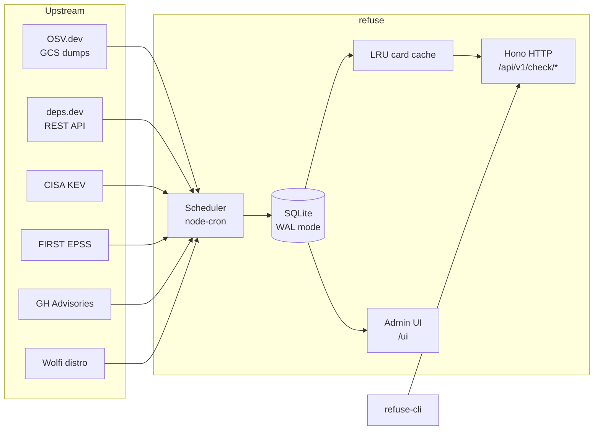

# Architecture

This document explains how refuse is put together — enough to land a meaningful PR without having to read the whole codebase first.

## The 30-second version



A single Node process:

1. **Ingests** vulnerability + metadata feeds on a cron schedule.
2. **Stores** the normalized result in local SQLite (a "card" per `(ecosystem, name, version)` keyed lookup).
3. **Answers** REST queries from `refuse-cli` or any HTTP client that wants to vet a package install before it happens.

No queues, no Redis, no Postgres, no external state. The only thing on disk is `data/refuse.db`.

## Layout

```
apps/server/
  src/
    index.ts            # boot: config → db → router → scheduler → listen
    config.ts           # Zod-validated env vars
    http/
      router.ts         # all routes (/healthz, /readyz, /api/*, /mcp, /ui)
      rest.ts           # /api/v1/check/* handlers
      admin.ts          # /api/admin/* + /api/keys/* handlers
      auth.ts           # bearer-token middleware
    ingest/
      scheduler.ts      # node-cron scheduler + bootstrap-on-empty
      cron.ts           # the three job entry points (osv-delta, osv-bulk, deps-dev, enrichment) + progress logging
      normalize.ts      # OSV → internal record shape
      upsert.ts         # ingestion_state writes + card affected-key tracking
      publish-cards.ts  # card-cache invalidation after upsert
      recompute-cards.ts
      recompute-severity.ts
      cvss.ts
      sources/
        osv.ts          # OSV.dev per-ecosystem and bulk archive streaming
        deps-dev.ts     # deps.dev REST
        kev.ts          # CISA KEV
        epss.ts         # FIRST EPSS streaming CSV
        ghsa-direct.ts  # GitHub Security Advisories via GraphQL
        wolfi.ts        # Wolfi distro packages
    parsers/
      lockfile/         # one file per format (npm, pnpm, yarn, bun, pip, …)
      dockerfile/       # base-image + RUN apt-get/pip parsing
      workflow/         # GitHub Actions YAML
    db/
      client.ts         # better-sqlite3 setup (WAL, pragmas)
      migrate.ts        # ordered SQL migration runner
      adapter.ts        # query layer facade used by ingest + http
    migrations/         # ordered SQL files (append-only)
    cards/              # LRU on top of SQLite card lookups
    tools/              # the six check_* tools (package, batch, lockfile, dockerfile, workflow, suggest-safe-version)
    keys/               # API-key CRUD helpers
    ui/static/          # vanilla HTML + JS admin dashboard
    mcp/                # placeholder for the upcoming MCP transport
packages/
  shared/               # Zod schemas, ecosystem enum, DB row types
  versions/             # per-ecosystem semver-equivalent comparators
docker/                 # multi-stage Dockerfile + compose
docs/                   # user-facing
scripts/audit.sh        # CI gate: rejects vendor-locked deps in source
```

## Data model

Each row in the `cards` table is a denormalized, query-ready answer for one `(ecosystem, name, version)` lookup. We build cards from raw upstream data in `cards/` so that the hot read path is a single indexed SELECT.

Other tables:

- `vulnerabilities` — normalized records, keyed by `refuse_id` with `aliases` (CVE / GHSA / OSV ID).
- `affected_packages`, `package_versions` — derived from `affected[]` entries.
- `kev` — CISA's "known exploited" list.
- `epss` — FIRST exploit-prediction scores (probability + percentile).
- `ingestion_state` — last-run timestamp + `last_ok_at` per source. Drives `/readyz` and the admin `/sources` panel.
- `api_keys` — optional bearer tokens (with CRUD via admin API).

Schema is split across the ordered files in `apps/server/src/migrations/`. New schema changes are new migration files; never edit old ones.

## Ingest pipeline

The scheduler in `ingest/scheduler.ts` registers three top-level node-cron jobs, each guarded by an in-process concurrency lock so a tick that takes longer than the cron interval skips the next firing rather than stacking.

| Job | Frequency | What it does |
|---|---|---|
| `osv-delta` | every `REFUSE_OSV_FREQUENCY` min (default 5) | All 26 ecosystems in parallel, capped by `REFUSE_OSV_CONCURRENCY` (default 4). Each ecosystem applies the per-ecosystem watermark; after the first bootstrap each tick is seconds-fast. |
| `deps-dev` | every `REFUSE_DEPS_DEV_FREQUENCY` min (default 15) | Refreshes `package_versions` rows: latest stable + license per package, paginated cursor in `ingestion_state.last_modified`. |
| `enrichment` | `REFUSE_ENRICHMENT_CRON` (default daily 05:00 UTC) | KEV → EPSS → GHSA-direct → Wolfi, sequentially, each wrapped in its own try/catch so a single failure doesn't block the next source. |

On boot with an empty `vulnerabilities` table the scheduler kicks an extra one-shot `osv-bulk` job — a streaming download of OSV's bulk `all.zip` (~280K records, every ecosystem in one pass). That's the ~3 min cold seed; subsequent restarts on the same `/data` volume skip it. The scheduler also kicks `deps-dev` and `enrichment` whose `ingestion_state.last_ok_at` is still NULL, so an upgrade from a snapshot that was OSV-only doesn't have to wait for the daily enrichment cron.

Each source adapter is responsible for:

1. Pulling from upstream.
2. Validating with the Zod schema in `packages/shared/src/schema.ts`.
3. Upserting into the relevant table.
4. Marking its row in `ingestion_state` (success or error).

Adapters are pure-ish: they take a DB facade + a `fetch` and return a count. This makes them testable without mocking HTTP.

## Hot path: a `/api/v1/check/package` request

```
client → Hono router → auth middleware → handler
                                       ↓
                            normalize ecosystem string
                                       ↓
                            normalize version (PEP 440 / semver / etc.)
                                       ↓
                            LRU cache hit?  → yes → respond
                                       ↓ no
                            SQL: SELECT card WHERE eco=? AND name=? AND version range matches
                                       ↓
                            populate LRU, respond
```

Typical p99 on a warmed cache is under 5 ms locally.

## Parsers

Lockfile parsers, the Dockerfile parser, and the GitHub Actions parser are **pure functions**. They take a string and return a `ParseResult` (list of `(ecosystem, name, version)` triples plus metadata). No I/O, no logging.

This is intentional. It means:

- They're trivially testable (paste a real lockfile into `*.test.ts`).
- They can run in CI, in a Docker build stage, or in a browser.
- New ecosystems can be added by anyone without touching the server.

## Readiness signal

`GET /readyz` returns the per-source bootstrap state — 503 with `pending_sources: ["kev","epss",...]` while sources are still doing their first run, 200 once each required source has a `last_ok_at`. The bootstrap on an empty DB kicks `osv-bulk` + `deps-dev` + `enrichment` in parallel; on persistent-volume restarts it short-circuits and returns 200 immediately. Suitable for Docker `--health-cmd` (via `node -e`) and Kubernetes readinessProbe.

## What lives where

| Concern | Lives in |
| --- | --- |
| Adding a new vulnerability source | `apps/server/src/ingest/sources/<source>.ts` + a `recordIngestionState(...)` call |
| Adding a new package manager | `packages/versions/src/<eco>.ts` + `packages/shared/src/ecosystems.ts` + `apps/server/src/parsers/lockfile/<eco>.ts` |
| Tweaking the HTTP API | `apps/server/src/http/router.ts` + `apps/server/src/http/rest.ts` |
| Changing the DB schema | New file in `apps/server/src/migrations/` (never edit old ones) |
| Auth / API keys | `apps/server/src/http/auth.ts` + `apps/server/src/keys/` |
| Admin dashboard | `apps/server/src/ui/static/` |

## Non-goals

A few things that refuse explicitly will **not** become:

- A general-purpose SCA tool. We're focused on the gate-at-install moment, not the post-hoc audit. (See OSV-scanner, Trivy, Dependency-Track for that.)
- A package registry. We don't host packages.
- A typosquatting / malicious-package detector. That's a separate problem domain. (See guarddog, npq.)
- A policy engine. The decision is "advisory above threshold = block." Severity threshold and fail-mode are the only knobs.

These are constraints, not insults to other tools — they exist to keep refuse small enough to read in an evening.

## Related repositories

- [refuse-cli](https://github.com/RefuseHQ/refuse-cli) — the CLI shim that calls this server.
