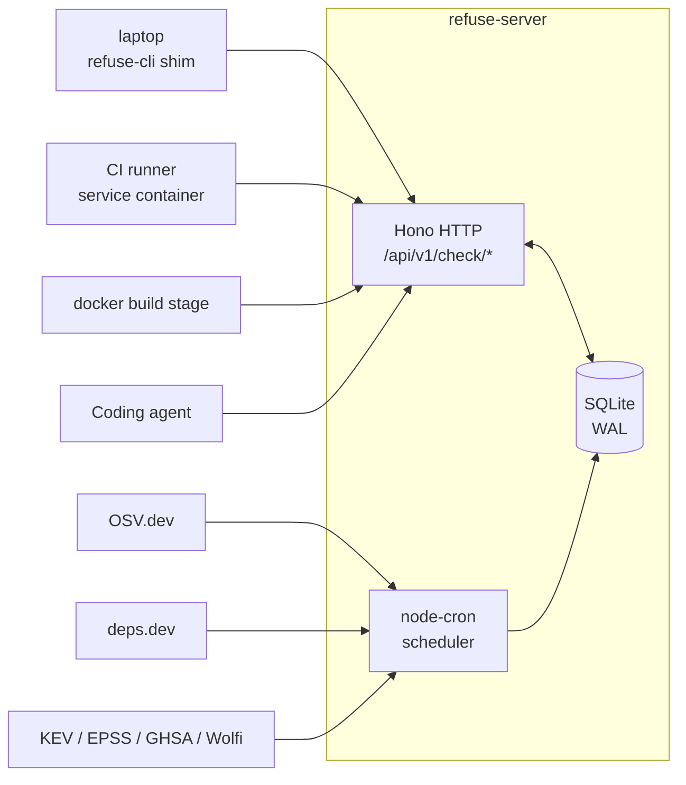

<div align="center">

# refuse

**Self-hostable backend that blocks vulnerable package installs — on laptops, in CI, and during Docker builds.**

[](https://github.com/RefuseHQ/refuse/actions/workflows/ci.yaml)
[](https://github.com/RefuseHQ/refuse/actions/workflows/codeql.yml)
[](LICENSE)
[](https://github.com/RefuseHQ/refuse/pkgs/container/refuse)
[](https://github.com/RefuseHQ/refuse/releases)

</div>

A small HTTP service that ingests public vulnerability + metadata feeds — [OSV](https://osv.dev/), [deps.dev](https://deps.dev/), [CISA KEV](https://www.cisa.gov/known-exploited-vulnerabilities-catalog), [FIRST EPSS](https://www.first.org/epss/), [GitHub Security Advisories](https://github.com/advisories), [Wolfi](https://github.com/wolfi-dev/advisories) — into a local SQLite database and answers questions like:

- *Is `lodash@4.17.10` vulnerable?*
- *What's the minimum-safe upgrade for `requests`?*
- *Are any of the 250 packages in this `package-lock.json` known-bad?*
- *Does this Dockerfile install a CVE-laden apt package?*

The intended caller is [`refuse-cli`](https://github.com/RefuseHQ/refuse-cli) — a tiny shim that wraps `npm`, `pnpm`, `yarn`, `pip`, `cargo`, `gem`, `bun`, `go` and refuses to run an install for a known-bad package. The server is also a plain REST API, so `curl`, a CI step, or any other client can use it.

---

## Where it runs

### 1. On a developer's laptop — block local `npm install`

```sh
# bring the server up once
docker compose up -d

# point refuse-cli at it
refuse config set server_url http://localhost:8080
refuse install                  # drops PATH shims into ~/.refuse/bin

# from now on, every install goes through the local server
npm install lodash@4.17.10
# → refuse: blocked — CVE-2019-10744 (high); suggested 4.17.21
```

### 2. In a GitHub Actions runner — fail PRs that bring in a vulnerable dependency

```yaml
jobs:
  install:
    runs-on: ubuntu-latest
    services:
      refuse:
        image: ghcr.io/refusehq/refuse:latest
        ports: ["8080:8080"]
        options: --health-cmd "node -e \"fetch('http://127.0.0.1:8080/healthz').then(r=>process.exit(r.ok?0:1))\""
    steps:
      - uses: actions/checkout@v4
      - uses: RefuseHQ/refuse-cli@v0   # installs the refuse binary on the runner
      - run: refuse config set server_url http://refuse:8080
      - name: Vet the lockfile before install
        run: refuse check-lockfile package-lock.json   # exits 2 on a vulnerable hit
      - run: npm ci
```

### 3. In a Docker image build — keep CVEs out of the image

```dockerfile
FROM node:20-bookworm-slim AS build

# Pull a refuse-cli binary into the build stage.
COPY --from=ghcr.io/refusehq/refuse-cli:latest /usr/local/bin/refuse /usr/local/bin/refuse

WORKDIR /app
COPY package.json package-lock.json ./

# Fail the build before any package is installed.
ARG REFUSE_SERVER_URL=https://refuse.your-domain.com
RUN refuse check-lockfile package-lock.json

RUN npm ci
COPY . .
```

For the "scan the Dockerfile itself before the build" pattern, run `refuse audit` from a preceding CI step (it walks the repo and discovers every Dockerfile / lockfile / workflow), or hit the `check_dockerfile` tool directly via `POST /api/v1/check/dockerfile` with the file contents — it parses both the base image's distro packages and any `RUN pip install` / `RUN apt-get install` lines.

---

## What it does

- **REST API** at `/api/v1/check/*` — `package`, `batch`, `lockfile`, `dockerfile`, `workflow`, `suggest-safe-version`. JSON in, JSON out, bearer auth optional.
- **Six tools** wired to the API: single-package check, batch parallel scan, full lockfile, Dockerfile (base image + RUN lines), GitHub Actions `uses:` entries, minimum-safe-upgrade suggestion.
- **In-process ingestion via `node-cron`.** Three jobs:
  - OSV delta every ~5 min (round-robin across ecosystems, configurable)
  - deps.dev refresh every ~15 min (latest stable + license per package)
  - Daily enrichment at 05:00 UTC — CISA KEV, EPSS, GHSA direct, Wolfi
- **Embedded SQLite** (better-sqlite3, WAL mode). One file, mounted from the host.
- **Optional API-key auth** — anonymous by default; flip a single env var to require bearer tokens.
- **Built-in admin UI** at `/ui/` — vanilla HTML/JS, no build step, ~30 KB. Source health, ingest triggers, key management.
- **Reads only from public sources.** No external service dependency at runtime.

> An `/mcp` endpoint for MCP-aware clients (Claude Code, Cursor, Codex, Antigravity) is on the [roadmap](./ROADMAP.md). The REST surface is the canonical interface today.

---

## How it fits



`refuse-cli` is the recommended caller because it handles PATH shimming, install-verb parsing, and the gate flow. Any HTTP client works too — see [`docs/api.md`](docs/api.md).

For a full walkthrough of the internals, see [ARCHITECTURE.md](./ARCHITECTURE.md).

---

## Quickstart

```sh
docker run --rm -p 8080:8080 -v "$PWD/data:/data" ghcr.io/refusehq/refuse:latest
```

First boot pulls an OSV snapshot (~2–3 minutes). After that, queries run from local SQLite:

```sh
curl -s -X POST http://localhost:8080/api/v1/check/package \
  -H 'Content-Type: application/json' \
  -d '{"ecosystem":"npm","name":"lodash","version":"4.17.10"}' | jq .

# {
#   "vulnerable": true,
#   "package": "lodash",
#   "version": "4.17.10",
#   "vulnerabilities": [
#     { "cve": "CVE-2019-10744", "severity_label": "high", … }
#   ],
#   "suggested_fixes": [
#     { "version": "4.17.21", "type": "minimum_safe", "breaking_change": false }
#   ]
# }
```

Or browse to <http://localhost:8080/ui/> for the dashboard.

---

## Production deploy (compose)

```yaml
services:
  refuse:
    image: ghcr.io/refusehq/refuse:latest
    ports: ["8080:8080"]
    volumes: ["./data:/data"]
    restart: unless-stopped
    environment:
      REFUSE_REQUIRE_KEY: "true"
      REFUSE_ADMIN_TOKEN: "${REFUSE_ADMIN_TOKEN:?set it before starting}"
      # REFUSE_GITHUB_TOKEN: ghp_... (optional, raises GHSA ingest rate limit)
    healthcheck:
      test: ["CMD", "node", "-e", "fetch('http://127.0.0.1:8080/healthz').then(r=>process.exit(r.ok?0:1))"]
      interval: 30s
      retries: 3
```

See [`docker/docker-compose.with-key.yml`](docker/docker-compose.with-key.yml) for the same with comments. Released images are [cosign-signed](https://github.com/sigstore/cosign) and ship with SLSA build provenance — see [SECURITY.md](./SECURITY.md) for verification.

---

## Configuration

Everything is env-driven. Defaults pick safe values so `docker run` works without any flags.

| Variable | Default | Purpose |
| --- | --- | --- |
| `REFUSE_PORT` | `8080` | HTTP listen port |
| `REFUSE_DB_PATH` | `/data/refuse.db` | SQLite file path |
| `REFUSE_REQUIRE_KEY` | `false` | Require `Authorization: Bearer rfs_…` on `/api/v1/check/*` |
| `REFUSE_ADMIN_TOKEN` | *(unset)* | Static bearer for admin UI + key CRUD |
| `REFUSE_OSV_FREQUENCY` | `5` | Minutes between OSV delta runs |
| `REFUSE_DEPS_DEV_FREQUENCY` | `15` | Minutes between deps.dev runs |
| `REFUSE_ENRICHMENT_CRON` | `0 5 * * *` | Cron expression for KEV/EPSS/GHSA/Wolfi |
| `REFUSE_BOOTSTRAP_ON_EMPTY` | `true` | Synchronous OSV pull on first boot if DB is empty |
| `REFUSE_DISABLE_INGEST` | `false` | Read-only mirror mode (for pre-seeded snapshots) |
| `REFUSE_GITHUB_TOKEN` | *(unset)* | Optional GH token, raises the GHSA-direct rate limit |
| `REFUSE_CARD_CACHE_SIZE` | `5000` | LRU entries for built `VulnCard`s |
| `REFUSE_CARD_CACHE_TTL_SECONDS` | `600` | TTL on that LRU |
| `REFUSE_LOG_LEVEL` | `info` | `debug` / `info` / `warn` / `error` |
| `REFUSE_CORS_ORIGIN` | `*` | CORS allow-origin on `/api/v1/check/*` |

Full reference: [`docs/configuration.md`](docs/configuration.md).

---

## API surface

| | |
| --- | --- |
| `GET  /healthz` | Liveness probe |
| `POST /api/v1/check/package` | Single-package vuln check |
| `POST /api/v1/check/batch` | Many packages in parallel |
| `POST /api/v1/check/lockfile` | Parse + scan an entire lockfile |
| `POST /api/v1/check/dockerfile` | Parse + scan base image + RUN lines |
| `POST /api/v1/check/workflow` | Scan GitHub Actions `uses:` entries |
| `POST /api/v1/suggest-safe-version` | Minimum-safe upgrade for an affected package |
| `GET  /api/admin/stats` | DB row counts (admin token) |
| `GET  /api/admin/sources` | Last-run / last-OK per ingest source |
| `POST /api/admin/ingest/{osv,deps-dev,enrichment}` | Manual trigger |
| `GET/POST/DELETE /api/keys[/:id]` | API key CRUD |
| `GET  /ui/` | Admin dashboard for self-hosted operators |

Full schema reference: [`docs/api.md`](docs/api.md).

---

## The refuse family

| | What it is | When to use it |
| --- | --- | --- |
| **[refuse](https://github.com/RefuseHQ/refuse)** (this) | Self-hostable HTTP server | You want your own backend — air-gapped, on-prem, or just because |
| **[refuse-cli](https://github.com/RefuseHQ/refuse-cli)** | PATH shim that wraps `npm` / `pip` / `cargo` / … | You want to block installs before they happen, on a dev machine or CI |

Both share parsers, version comparators, and the OSV-derived data model.

---

## How it compares

| | refuse | OSV-scanner | Trivy / Grype | Dependency-Track | guarddog | npq |
| --- | --- | --- | --- | --- | --- | --- |
| OSS license | Apache-2.0 | Apache-2.0 | Apache-2.0 | Apache-2.0 | Apache-2.0 | MIT |
| Standalone server | ✅ | — | partial | ✅ | — | — |
| **Install-time gate via PATH shim** (with [`refuse-cli`](https://github.com/RefuseHQ/refuse-cli)) | ✅ | — | — | — | — | ✅ |
| **Runs in CI as a service container** | ✅ | ✅ | ✅ | partial (SBOM upload) | ✅ | — |
| **Scans Dockerfiles during build** | ✅ | — | ✅ (different mechanism) | — | — | — |
| OSV data | ✅ | ✅ | ✅ | ✅ | — | — |
| KEV / EPSS enrichment | ✅ | — | partial | ✅ | — | — |
| GitHub Actions `uses:` scanning | ✅ | — | partial | — | — | — |
| Heuristic malicious-package detection | partial | — | — | — | ✅ | partial |
| Single-container deploy | ✅ | n/a | ✅ | ✅ | n/a | n/a |

`refuse`'s differentiator is **install-time gating** — refusing the install before it runs, rather than reporting on a tree after the fact. The CLI shim makes that gate transparent to the developer or CI step. If you already run Trivy or Dependency-Track for the post-install monitoring angle, refuse composes with them: the structured refusal records (package, version, reason, OSV id) drop into either pipeline.

---

## Self-host walkthrough

### Single developer (laptop)

```sh
mkdir -p ~/refuse-data
docker run -d --name refuse \
  -p 8080:8080 -v ~/refuse-data:/data \
  --restart unless-stopped \
  ghcr.io/refusehq/refuse:latest

# install the CLI (from the refuse-cli repo)
brew install refusehq/tap/refuse
refuse config set server_url http://localhost:8080
refuse install
```

Anonymous mode is fine here — the server only binds to `localhost`.

### Team CI runner (service container)

In your workflow:

```yaml
services:
  refuse:
    image: ghcr.io/refusehq/refuse:latest
    env:
      REFUSE_REQUIRE_KEY: "true"
      REFUSE_ADMIN_TOKEN: ${{ secrets.REFUSE_ADMIN_TOKEN }}
    ports: ["8080:8080"]
```

Create one shared API key via `POST /api/keys` once (out of band), store as a repo secret `REFUSE_API_KEY`, and pass it to every step: `REFUSE_API_KEY: ${{ secrets.REFUSE_API_KEY }}`.

The first run after each container boot will need to fetch a fresh OSV snapshot. For long-lived runners, mount a cache volume; for ephemeral runners, set `REFUSE_BOOTSTRAP_ON_EMPTY=false` and ship a pre-seeded `refuse.db` via the runner cache.

### Fleet (real domain, persistent volume)

Behind nginx/Caddy with TLS:

```yaml
services:
  refuse:
    image: ghcr.io/refusehq/refuse:latest
    volumes: ["/srv/refuse:/data"]
    environment:
      REFUSE_REQUIRE_KEY: "true"
      REFUSE_ADMIN_TOKEN: "${REFUSE_ADMIN_TOKEN}"
      REFUSE_GITHUB_TOKEN: "${REFUSE_GITHUB_TOKEN}"
      REFUSE_CORS_ORIGIN: "https://your-app.example.com"
    restart: unless-stopped
```

Point a DNS record at the host, terminate TLS in your reverse proxy, and rotate `REFUSE_ADMIN_TOKEN` periodically. Back up `/srv/refuse/refuse.db` with a cron `cp` — SQLite WAL makes a hot copy safe.

Detailed guide: [`docs/self-hosting.md`](docs/self-hosting.md).

---

## Build from source

```sh
git clone https://github.com/RefuseHQ/refuse.git
cd refuse
pnpm install
pnpm typecheck && pnpm test
pnpm --filter @refuse-oss/server dev      # hot reload on src/

# build the Docker image locally
make docker
make docker-run                            # → http://localhost:8080
```

Repo layout:

```
apps/server/             # Hono server, REST API, tools, ingest, UI
  src/
    config.ts            # env validation
    db/                  # SQLite client + D1-shape facade + migrations
    http/                # router, REST, auth, admin
    tools/               # the six check_* tools
    ingest/              # cron scheduler + OSV/deps.dev/KEV/EPSS/GHSA/Wolfi
    cards/               # VulnCard reader (LRU on top of SQLite)
    ui/static/           # tiny vanilla SPA
packages/
  shared/                # zod schemas, ecosystem normalization
  versions/              # version matchers (semver, pypi, maven, dpkg, …)
docker/                  # Dockerfile + compose examples + entrypoint
```

See [ARCHITECTURE.md](./ARCHITECTURE.md) for the deeper walkthrough.

---

## Status

Alpha. The REST + ingestion + CLI integration is feature-complete and verified end-to-end. The `/mcp` MCP-transport endpoint is currently a stub returning 501 — it will be wired up post-v0.1.0 for users who want a self-hosted MCP target. See [ROADMAP.md](./ROADMAP.md) and the [open issues](https://github.com/RefuseHQ/refuse/issues).

---

## Contributing

Issues, fixes, and new ecosystem matchers are welcome. See [CONTRIBUTING.md](./CONTRIBUTING.md). Before opening a PR:

```sh
pnpm typecheck && pnpm test
./scripts/audit.sh        # guards against vendor-locked URLs and runtime env-var leakage
make docker               # confirms the image still builds
```

## Security

Security policy: [SECURITY.md](./SECURITY.md). Report privately via [hello@refuse.dev](mailto:hello@refuse.dev) or [GitHub private vulnerability reporting](https://github.com/RefuseHQ/refuse/security/advisories/new).

## Acknowledgments

Built on top of [OSV.dev](https://osv.dev/), [deps.dev](https://deps.dev/), the [CISA KEV catalog](https://www.cisa.gov/known-exploited-vulnerabilities-catalog), [FIRST EPSS](https://www.first.org/epss/), [GitHub Security Advisories](https://github.com/advisories), and the [Wolfi advisories](https://github.com/wolfi-dev/advisories). All free, all maintained by people doing the real work — refuse is mostly plumbing on top of theirs.

## License

[Apache License 2.0](./LICENSE) © RefuseHQ.
